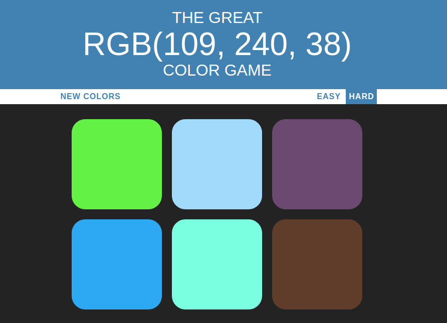

# Color Guessing Game

This is a VanillaJS practice project I created to introduce myself to Javascript. If you're this deep into learning about my background and wanna kill some time, read on!

## Instructions

Go to [this repo's gh-pages site](https://mattlisle.github.io/color-guessing-game/) to play.

Guess which color square corresponds to the RGB color written at the top of the page. If you click the right color, every color will light up, and you will feel a big enough sense of accomplishment to play again :party:

